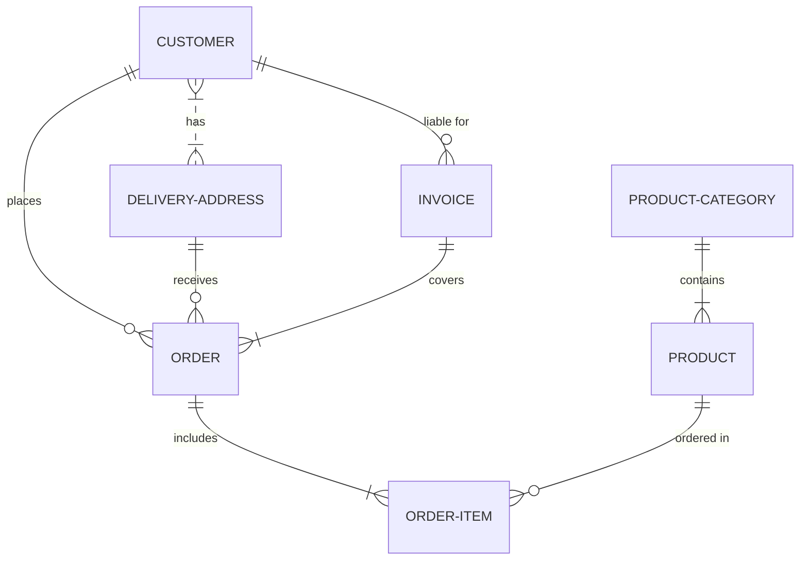
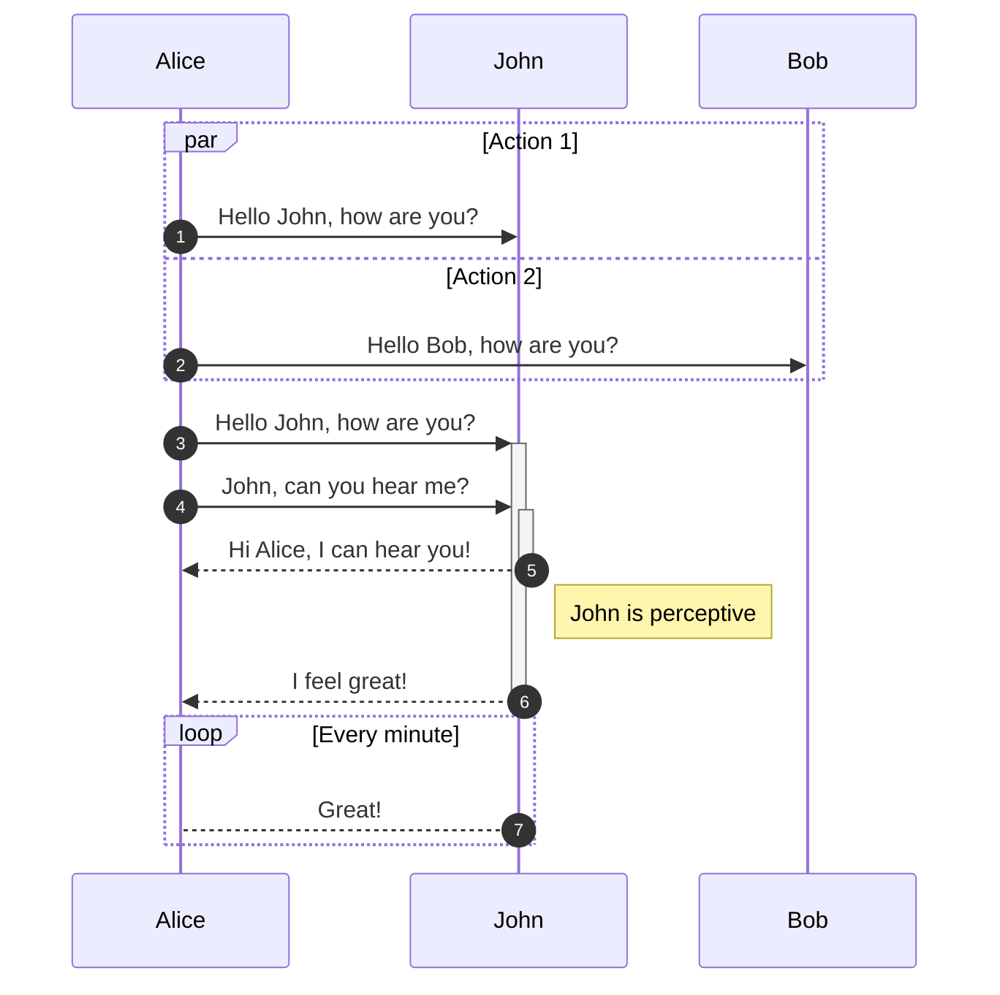

# Mermaids

A mermaid diagram, using the plugin `md-mermaid` fish tails syntax:

    ​~~~mermaid
    ...
    ​~~~

​~~~mermaid
graph TD
A[Client] -->|tcp_123| B
B(Load Balancer)
B -->|tcp_456| C[Server1]
B -->|tcp_456| D[Server2]
​~~~

An `erDiagram` type graph, using the backtick "\`" syntax:

    ```mermaid
    ...
    ```



## HTML class Include

You can apply a mermaid main using the html `div` with a class of `.mermaid`:

    <div class="mermaid">
        ...
    </div>

<div class="mermaid">
    graph TD
    A[Client] --> B[Load Balancer]
    B --> C[Server1]
    B --> D[Server2]
</div>


## Sequence Diagram

An example of a `sequenceDiagram` using the backtick "\`" syntax:

    ```mermaid
    ...
    ```




## Graph Diagram

A graph using the fish-tail syntax:

    ​~~~mermaid
    ​~~~

​~~~mermaid
graph TB
D --> E
E --> F
​~~~


​~~~mermaid
graph TD
  A[Christmas] -->|Get money| B(Go shopping)
  B --> C{Let me think}
  B --> G[/Another/]
  C ==>|One| D[Laptop]
  C -->|Two| E[iPhone]
  C -->|Three| F[fa:fa-car Car]
  subgraph section
    C
    D
    E
    F
    G
  end
​~~~
